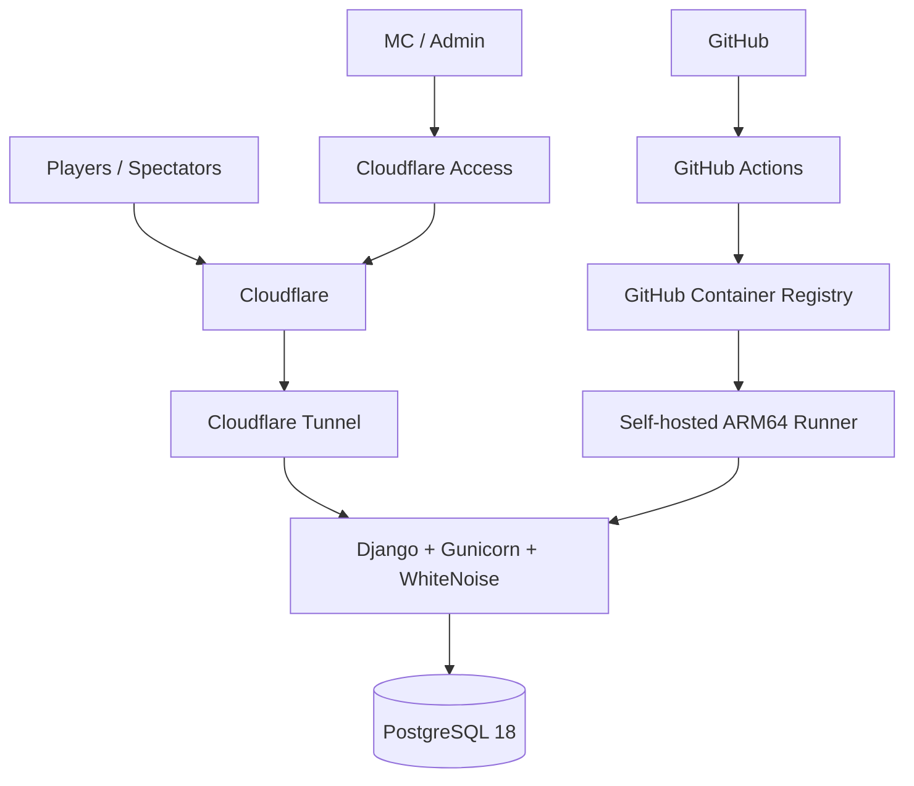

---

# Building Trivia League: Django, Double Elimination, and a Raspberry Pi Production Pipeline

I wanted a better way to run live trivia nights.

Not just a bracket generator and not a giant event-management platform. I wanted something that handled the actual flow: players checking in, teams forming, an MC locking registration, a tournament bracket appearing, winners being recorded, and spectators following along from their phones.

I also wanted it to live in my homelab instead of becoming another hosted SaaS bill.

That became **Trivia League**, a Django application running on a Raspberry Pi 4 named `JiggleJointPi`.



## What the application does

A player opens the join page and enters a first name, last name, and optional email. From there they can create a team, join an existing team, or join by code.

The team creator becomes captain.

While registration is open, the lobby updates as players join. When the MC locks registration, the application converts registration data into the event-scoped competition records used by the tournament.

One design choice mattered early: **players are persistent, teams are event-scoped**.

A person may come back every trivia night. A team name might not.

That lets player history grow later without forcing a permanent team model before the data justifies it.

## Why Django

I wanted something small enough to understand end to end.

Django provided the ORM, migrations, forms, sessions, auth, framework admin, templates, and testing model without requiring a pile of separate services.

Trivia League is a modular monolith:

```text
events
players
competition
```

`events` owns Trivia Nights and public history.

`players` owns persistent identity.

`competition` owns registration, teams, participants, matches, bracket generation, and winner routing.

I deliberately did not build an SPA. Django templates plus HTMX provide enough interactivity for this use case.

## Double elimination was the interesting part

Single elimination is straightforward.

Double elimination turned the project into something more than CRUD screens.

v1 supports 4–16 teams and uses one deliberate rule:

> The Grand Final is winner-take-all. There is no bracket reset.

That gives an intended game count of:

```text
2N - 2
```

So:

```text
5 teams -> 8 actual games
6 teams -> 10 actual games
```

### Power-of-two padding

Real trivia nights do not guarantee 4, 8, or 16 teams.

For other counts, the generator uses the next power-of-two internally:

```text
5 teams -> 8-slot structure
6 teams -> 8-slot structure
9 teams -> 16-slot structure
```

That keeps routing consistent but introduces structural internal matches.

The engine needs those nodes.

The UI should not show them as games.

## The production smoke test found a real UX bug

A 5-team production test exposed an issue I had not appreciated locally.

The competition routes worked, but the visible Losers Bracket changed shape as winners were entered.

Matches disappeared. Columns shifted. Eventually the bracket settled into the right form.

The problem was the display layer.

I was deciding whether a match was structural by looking at its **current** status and current team population. That meant the UI learned that a match was fake only after enough of the tournament had already happened.

The fix was to determine structural matches when the bracket is generated and persist that decision.

The invariant is now:

> Once the bracket is generated, the visible bracket never changes shape.

`TBD` becomes a team. Winners advance. Matches complete.

The topology stays fixed.

I also removed visible `Match 1`, `Match 2`, etc. labels. They were technically valid within each round but visually confusing in double elimination. Round names and connector lines communicate progression better.

## Building the bracket UI

The public and MC views use the same bracket formatter.

The UI is organized into:

- Winners Bracket
- Losers Bracket
- Championship

Connector lines are drawn in the browser using routing metadata already stored on the Match records.

The MC side polls during play.

The public side is manual-refresh in v1 to avoid unnecessary spectator polling.

The visual style uses a dark green, bronze, cream, and sparse red palette inspired by a motorsport/pub-trivia scoreboard rather than a generic SaaS dashboard.

## Running it on a Raspberry Pi

Trivia League runs on `JiggleJointPi`, a Raspberry Pi 4 already used for other homelab services.

The filesystem follows a consistent pattern:

```text
/opt/homelab/stacks/
/opt/homelab/data/
/opt/homelab/exports/
/opt/homelab/secrets/
```

Trivia League uses:

```text
/opt/homelab/stacks/trivia-league
/opt/homelab/data/trivia-league/postgres
/opt/homelab/exports/trivia-league
/opt/homelab/secrets/trivia-league.env
```

PostgreSQL is private to the Docker backend network.

## No nginx

I intentionally skipped nginx.

Gunicorn runs Django.

WhiteNoise serves collected static assets.

Cloudflare Tunnel handles ingress.

For this application's scale, another reverse-proxy container would mostly add configuration I do not need.

## Cloudflare Tunnel and Access

The public application lives at:

```text
https://trivia.jackmazza.xyz
```

Cloudflare Tunnel routes directly to:

```text
http://trivia-league-web:8000
```

over the shared `public_web` Docker network.

No router port forwarding is required.

Administrative routes are protected twice:

```text
/admin/
/django-admin/
```

First Cloudflare Access requires an approved identity.

Then Django still requires staff authentication.

Public `/join/` and `/events/` routes remain open.

## CI/CD without a Git checkout on the Pi

Pull requests run CI with PostgreSQL and validate:

- Django system checks
- the test suite
- production static collection
- the Docker build

At the v1 production milestone, the suite had 29 passing tests.

A merge to `master` builds a `linux/arm64` container and pushes it to GHCR with an immutable Git SHA tag plus `latest`.

JiggleJointPi runs a self-hosted ARM64 GitHub Actions runner.

The deploy job does **not** check out source code on the Pi.

Instead it:

1. pulls the exact SHA image
2. records it in `.deploy.env`
3. force-recreates the web container
4. verifies the running image equals the requested SHA
5. checks the application over localhost HTTP
6. rolls back to the previous image if validation fails

A complete deployment was taking about three minutes during initial testing.

## The deploy pipeline caught its own bug

The first version of the deployment workflow looked successful but had not actually replaced the running container.

`.deploy.env` pointed at the new GHCR SHA, but Docker was still running the manually bootstrapped local image.

The health check passed because the **old** container was healthy.

The fix was to force recreation and compare:

```text
expected image
```

against:

```text
docker inspect trivia-league-web
```

before trusting the HTTP health check.

That turned a false-positive deploy into an actual verified deployment.

## Production smoke testing

Before touching production data, I captured the baseline:

```text
Seasons:       0
Trivia Nights: 0
Players:       0
Registrations: 0
Event Teams:   0
Participants:  0
Matches:       0
```

Then I created a clearly marked smoke-test event and ran the real flow: register teams, lock the event, generate the bracket, record winners, finish the Grand Final, inspect the public final bracket, and archive the event.

That test exposed the dynamic Losers Bracket problem described above.

After validation, I deleted the smoke-test competition data, players, and leftover test season, then confirmed production returned to the original zero-data baseline.

## One known UX follow-up

There is one item I intentionally left for later.

After a Trivia Night reaches `Complete`, `/events/current/` can still resolve to it.

The future behavior should be:

```text
Registration Open -> current
Live              -> current
Complete          -> historical/final
No open/live      -> no current event
```

I logged that as a GitHub issue instead of slipping another behavioral change into the v1 freeze.

## Backups are next

The Pi already runs encrypted nightly Restic backups.

Trivia League still needs to be integrated into that process.

The intended database path is:

```text
PostgreSQL
   ↓
nightly pg_dump
   ↓
/opt/homelab/exports/trivia-league
   ↓
encrypted Restic
```

I do not want to copy the live PostgreSQL directory and pretend that is a restore strategy.

The stack configuration, relevant encrypted configuration, and restore documentation will be included as well.

That work is documented as planned, not complete.

## What I like about the final architecture

Nothing here is especially exotic.

Django owns the application.

PostgreSQL owns the data.

Docker owns packaging.

Cloudflare owns ingress and the outer admin gate.

GitHub owns CI, image publishing, and deployment orchestration.

The Raspberry Pi runs immutable containers.

And the whole thing is still small enough that I can reason about it end to end.

That is exactly what I wanted from this project.

## What comes next

Once the system has real event history, the next version can start adding:

- rankings
- season standings
- historical statistics
- reporting
- analytics

For now, v1 does the job it was built for: get people into teams, run the tournament, show the bracket, crown a winner, and get out of the MC's way.

---

## Implementation Notes

### Production URL

```text
https://trivia.jackmazza.xyz
```

### Production stack

```text
Cloudflare
   ↓
Cloudflare Tunnel
   ↓
Django + Gunicorn + WhiteNoise
   ↓
PostgreSQL 18
```

### Deployment flow

```text
Pull Request
   ↓
GitHub Actions CI
   ↓
Merge to master
   ↓
ARM64 image build
   ↓
GitHub Container Registry
   ↓
JiggleJointPi self-hosted runner
   ↓
Production deployment + health verification
```

### Administrative protection

```text
/admin/
/django-admin/
```

are protected by both Cloudflare Access and Django staff authentication.

### Known post-v1 follow-up

A completed Trivia Night can still be treated as the Current Event. The desired future behavior is:

```text
registration_open -> current
live              -> current
complete          -> historical/final
no open/live      -> no current event
```

This is tracked separately as a GitHub issue.

### Backup status

Backup integration is intentionally not described as complete yet.

The planned design is:

```text
PostgreSQL
   ↓
nightly pg_dump
   ↓
/opt/homelab/exports/trivia-league
   ↓
encrypted Restic backup
```

The live PostgreSQL data directory should not be treated as the primary database backup artifact.
